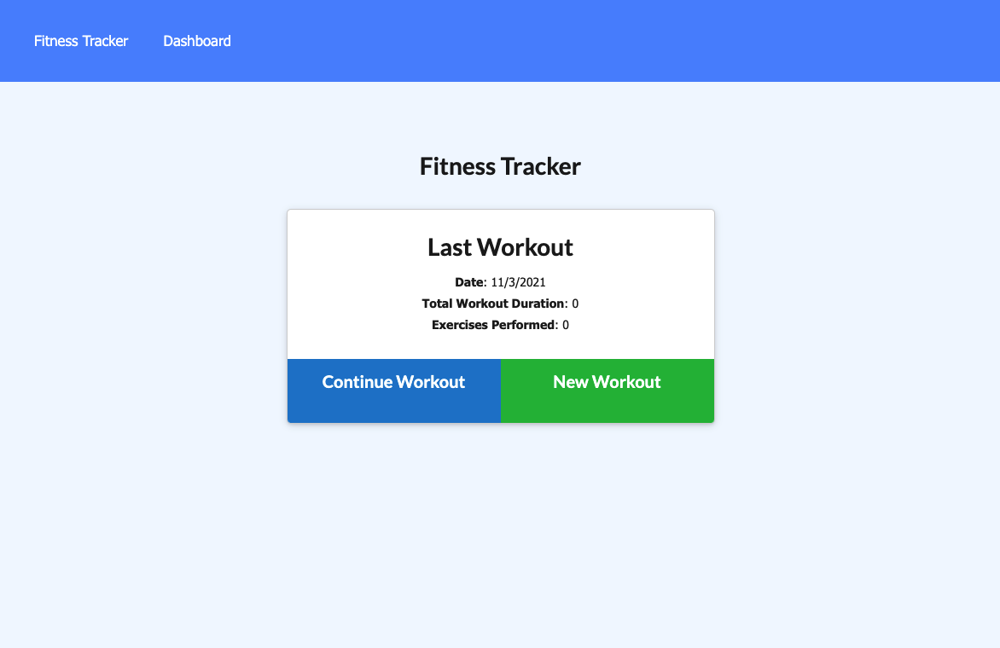
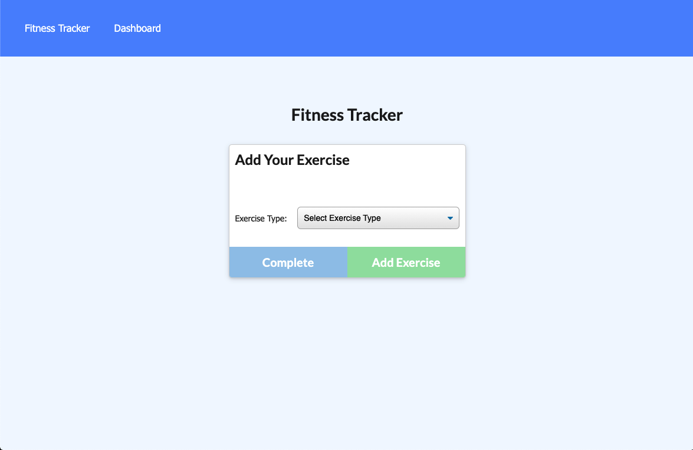
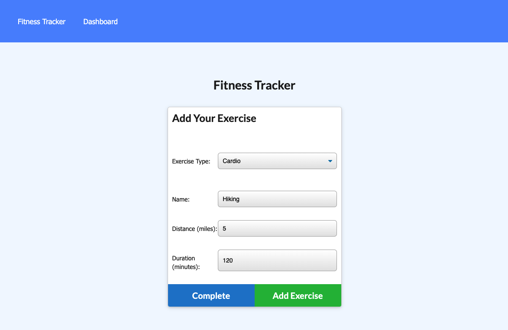
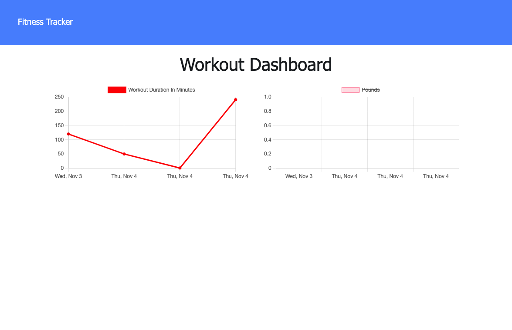

# Fitness-Tracker

<a href="https://choosealicense.com/licenses/mit" target="_blank"></a>

## Table of Contents

- [Description](#description)
- [Installation](#installation)
- [Usage](#usage)
- [Video](#video)

## Description

[Fitness Tracker App](https://azs6189-fitness-tracker.herokuapp.com/?id=61834056ee240f001670bdc4) allows user to be able to view create and track daily workouts. Users will be able to log multiple exercises in a workout on a given day. Users can track the name, type, weight, sets, reps, and duration of exercise.

## Installation

Clone this repository. Open the respository in a code editor such as VS Code.

1. Run npm install to ensure all required dependencies and node modules are installed.

```bash
npm install
```

2. Run "npm start" to begin your application at port 3000 localhost.

```bash
npm start
```

## Usage

From either the app deployed on Heroku or your local host, you will first see the homepage.



Click "Continue Workout" to add an exercise.



Fill out the question prompts to add your exercise.


To keep track of your exercise trends, click "Dashboard" in your navigation bar.

